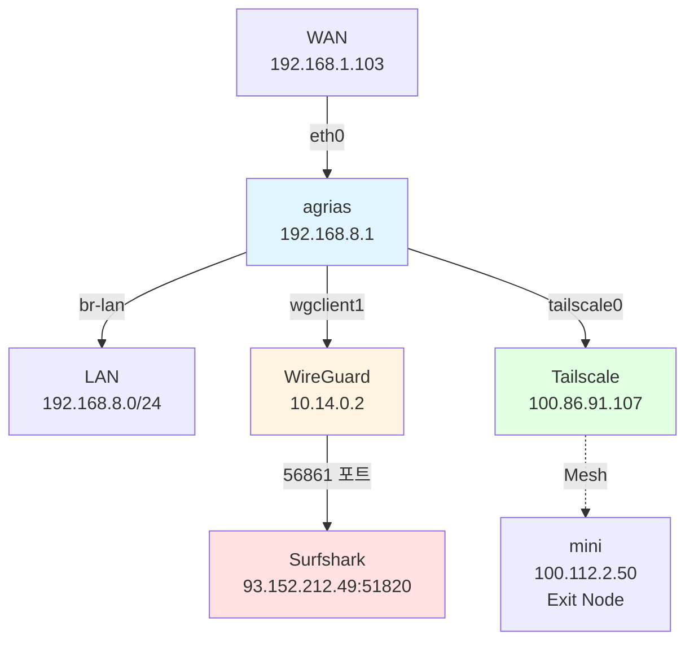
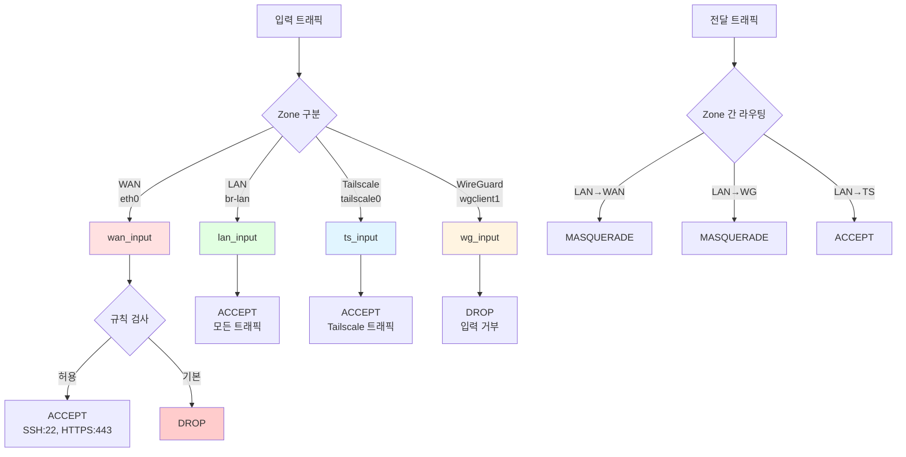

# agrias (GL-MT3000) 라우터 상태 보고서

**수집일자**: 2026-03-01
**장치**: GL.iNet GL-MT3000 (agrias)
**위치**: 베트남 호치민
**Tailscale**: bun-bull.ts.net
**IP**: 192.168.8.1

---

## 요약 (Executive Summary)

- **이중 VPN 구동**: Tailscale(100.86.91.107)과 WireGuard(wgclient1: 10.14.0.2)가 동시에 활성화되어 있음
- **WireGuard 연결**: Surfshark 서버(93.152.212.49:51820)와 연결됨. 최근 핸드셰이크 1분 전, 4.32 MiB 수신/2.70 MiB 송신
- **Tailscale 네트워크**: 9개 장치가 연결된 mesh 네트워크. 'mini' 장치(100.112.2.50)가 활성 상태이며 exit node 제공
- **방화벽 구성**: LAN/WAN/Tailscale/WireGuard 간 트래픽 제어. WAN 입력은 DROP 정책(SSH 22, HTTPS 443 허용)
- **DNS 서비스**: AdGuard Home, dnscrypt-proxy, dnsmasq가 다중 인스턴스로 실행 중

---

## 시스템 정보

### OS 정보
- **OS**: OpenWrt 21.02-SNAPSHOT
- **Kernel**: Linux 5.4.211 (#0 SMP Tue Aug 19 14:33:21 2025)
- **Architecture**: aarch64_cortex-a53 (ARM64)
- **Board**: mediatek/mt7981
- **Manufacturer**: OpenWrt (Generic)

### 하드웨어
- **Device**: GL.iNet GL-MT3000
- **MAC Address**: 94:83:c4:5f:4d:b8 (WAN), 94:83:c4:5f:4d:b9 (LAN)
- **CPU**: MediaTek MT7981 (Cortex-A53)

---

## 네트워크 토폴로지



### 인터페이스 상태

| 인터페이스 | IP 주소 | 상태 | 설명 |
|-----------|---------|------|------|
| eth0 | 192.168.1.103/24 | UP | WAN (DHCP) |
| br-lan | 192.168.8.1/24 | UP | LAN Bridge |
| wgclient1 | 10.14.0.2/8 | UP | WireGuard VPN |
| tailscale0 | 100.86.91.107/32 | UP | Tailscale VPN |
| ra0 | - | UP | 2.4GHz WiFi (AP) |
| rax0 | - | UP | 5GHz WiFi (AP) |
| lo | 127.0.0.1/8 | UP | Loopback |

### 라우팅 테이블

```
default via 192.168.1.1 dev eth0 proto static src 192.168.1.103 metric 10
100.64.0.0/10 dev tailscale0 scope link
192.168.1.0/24 dev eth0 proto static scope link metric 10
192.168.8.0/24 dev br-lan proto kernel scope link src 192.168.8.1
```

---

## WireGuard 구성

### 인터페이스 상태

| 항목 | 값 |
|------|-----|
| 인터페이스 | wgclient1 |
| 공개키 | 7opq3dCKEeKjDUXBTnVUEgqwnB1Uft8cv3G8bGi24yc= |
| 수신 포트 | 56861 |
| fwmark | 0x8000 |
| 피어 공개키 | bD/m2mdKxJXG2wTkLsmWpiW8xZwkDdrrrwC44auOhQg= |
| Endpoint | 93.152.212.49:51820 |
| Allowed IPs | 0.0.0.0/0, ::/0 (전체 트래픽) |
| 최근 핸드셰이크 | 1분 7초 전 |
| 전송/수신 | 4.32 MiB 수신, 2.70 MiB 송신 |
| Keepalive | 25초 간격 |

**참고**: WireGuard 설정 파일은 발견되지 않음 (UCI配置 없음). init script도 없음.

---

## 방화벽 구성

### 주요 규칙 요약

#### Zone 정책
- **LAN**: ACCEPT (입력/출력/전달 모두 허용)
- **WAN**: DROP 입력, ACCEPT 출력, REJECT 전달 (Masquerade 활성화)
- **Tailscale**: ACCEPT (입력/출력), REJECT 전달
- **WireGuard**: DROP 입력, ACCEPT 출력/전달 (Masquerade 활성화)
- **Guest**: 비활성화 (disabled='1')

#### 허용된 WAN 입력 규칙
- UDP 68: DHCP 갱신
- IGMP: 멀티캐스트 지원
- TCP 137-139,445: NetBIOS (DROP)
- TCP 6000-6002,6008: X11 (DROP)
- ICMP echo: Ping 허용
- TCP 443: HTTPS
- TCP 22: SSH

### 방화벽 흐름도



---

## 서비스 상태

### 활성화된 서비스 목록

| 서비스 | 포트 | 설명 | 상태 |
|--------|------|------|------|
| nginx | 80, 443 | 웹 서버 (리버스 프록시) | 활성 |
| uhttpd | 8080, 8443 | OpenWrt 웹 UI (localhost만) | 활성 |
| dropbear | 22 | SSH 서버 | 활성 |
| dnsmasq | 53, 2153 | DNS/DHCP (다중 인스턴스) | 활성 |
| tailscaled | 46943 | Tailscale 데몬 | 활성 |
| AdGuard Home | - | 광고 차단 DNS | 활성 |
| dnscrypt-proxy | - | 암호화 DNS | 활성 |
| avahi-daemon | - | mDNS/Bonjour | 활성 |
| cron | - | 예약 작업 | 활성 |

### 네트워크 연결 상태 (주요 포트)

| 프로토콜 | 포트 | 바인드 주소 | 프로그램 |
|---------|------|-----------|---------|
| TCP | 80 | 0.0.0.0 | nginx |
| TCP | 443 | 0.0.0.0 | nginx |
| TCP | 22 | 0.0.0.0 | dropbear |
| TCP | 8080 | 127.0.0.1 | uhttpd |
| TCP | 8443 | 127.0.0.1 | uhttpd |
| TCP/UDP | 53 | 모든 인터페이스 | dnsmasq |
| TCP | 46943 | 100.86.91.107 | tailscaled |
| UDP | 56861 | 0.0.0.0 | WireGuard |

---

## VPN 상태

### WireGuard (Surfshark)

**연결 상태**: 활성
- **Endpoint**: 93.152.212.49:51820
- **트래픽**: 4.32 MiB 수신, 2.70 MiB 송신
- **최근 활동**: 1분 7초 전 핸드셰이크
- **설정**: 전체 트래픽 라우팅 (0.0.0.0/0, ::/0)

### Tailscale

**본 장치**: agrias (100.86.91.107)
- **상태**: 온라인
- **IPv4**: 100.86.91.107
- **IPv6**: fd7a:115c:a1e0::bb32:5b6b

**연결된 장치** (9개):

| 장치명 | Tailscale IP | 플랫폼 | 상태 |
|--------|-------------|--------|------|
| agrias | 100.86.91.107 | Linux | - |
| 13-mini | 100.81.167.92 | iOS | - |
| deck | 100.112.63.2 | Linux | - |
| deneb | 100.122.60.35 | Linux | Idle; Exit Node 제공 |
| heritage | 100.123.158.20 | Linux | - |
| ion-dxp-bastion | 100.80.7.31 | Linux | - |
| m1-pro | 100.110.172.36 | iOS | - |
| mini | 100.112.2.50 | macOS | **Active**; Exit Node 제공 |
| surface | 100.111.235.71 | Windows | Offline |
| z-5 | 100.79.219.51 | Android | - |

**참고**: 'mini' 장치가 활성 상태이며 로컬 네트워크(192.168.1.104:41641)에서 직접 연결됨. tx 138188 bytes, rx 51220 bytes.

---

## 설치된 패키지

### VPN 관련
- **tailscale**: 1.80.3-1
- **wireguard-tools**: 1.0.20210223-2
- **kmod-wireguard**: 5.4.211-1
- **openvpn-openssl**: 2.6.12-1

### GL.iNet SDK
- **gl-sdk4-firewall**: git-2025.219.32390-9bb5750-1
- **gl-sdk4-luci**: git-2025.224.24679-7c2828d-1
- **gl-sdk4-tailscale**: git-2025.115.15781-4b8df63-1
- **gl-sdk4-ui-firewallview**: git-2025.162.37381-9033056-1
- **gl-sdk4-ui-tailscaleview**: git-2025.155.04603-c86dc60-1

### 웹 서버
- **uhttpd**: 2021-03-21-15346de8-2
- **uhttpd-mod-ubus**: 2021-03-21-15346de8-2

### 기타
- **firewall**: 2021-03-23-61db17ed-1.2

---

## 최근 로그 분석

### WiFi 연결 문제 (21:23:38 - 21:23:45)
- 장치 `92:37:fd:ab:ae:9e`가 연결 시도 후 WPA 4-way handshake 타임아웃으로 실패
- "4Way-MSG1 timeout" 오류 반복
- DEAUTH (ReasonCode 2)로 연결 해제

### SSH 접속 기록 (21:35:08 - 21:37:01)
- 100.112.2.50 (mini 장치)에서 SSH 접속 시도
- SSH 공개키 인증 성공 (root 사용자)
- ed25519 키: SHA256:SX+e5TZJWlUAZnLqyPZh0seLH7Kgu0uVPLnsHrp2ZTE
- 여러 번의 접속/종료 반복 (데이터 수집 스크립트 실행)

---

## 보안 고려사항

1. **SSH 접근**: WAN에서 SSH(22)와 HTTPS(443)가 허용되어 있음. Tailscale을 통한 접속 권장
2. **DNS 보안**: AdGuard Home과 dnscrypt-proxy가 실행 중이지만, 실제 필터링 동작은 추가 확인 필요
3. **VPN 분리**: WireGuard와 Tailscale이 동시에 실행되어 트래픽 경로가 복잡할 수 있음
4. **로그인**: root 계정이 SSH에 노출되어 있음. 키 기반 인증 사용 중

---

## 부록: 전체 원시 데이터

전체 데이터는 `raw-data-20260301_213701.txt` 파일을 참조하십시오.

**파일 크기**: 57 KB (869 라인)

---

## 문서 정보

- **생성일자**: 2026-03-01
- **데이터 수집 시간**: 21:37:01 UTC
- **분석 도구**: agrias-investigation 스크립트
- **버전**: 1.0
