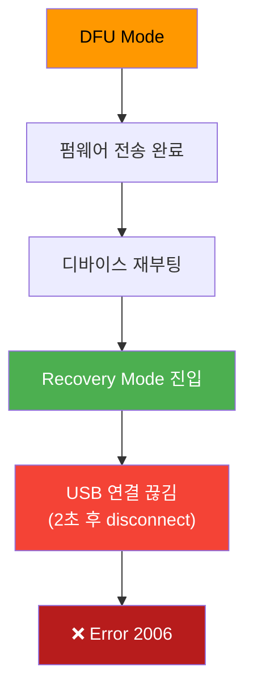
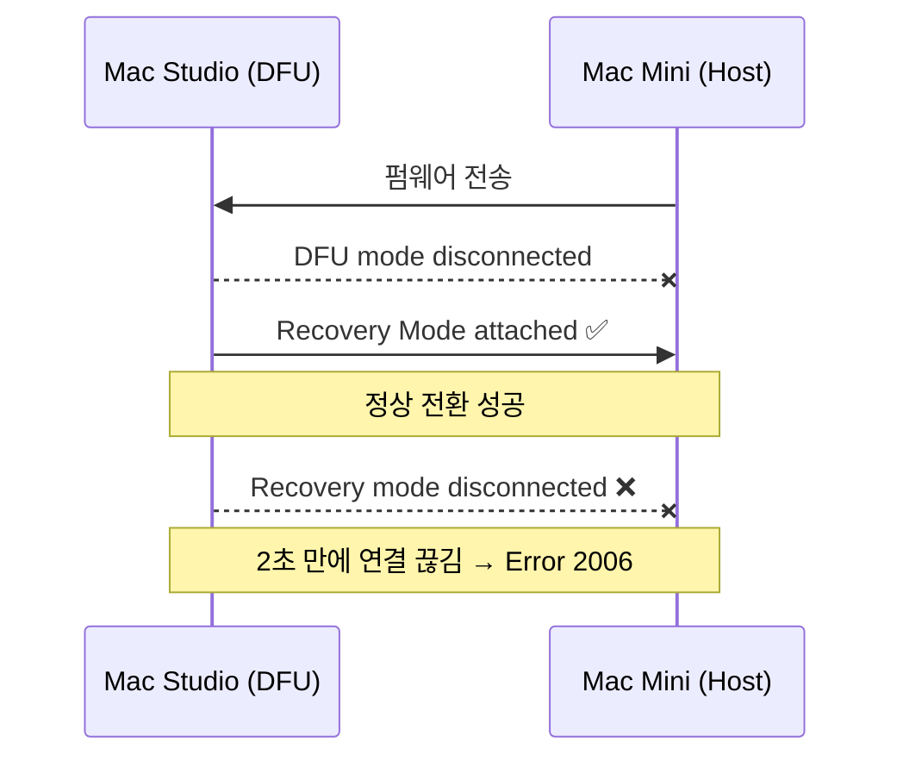
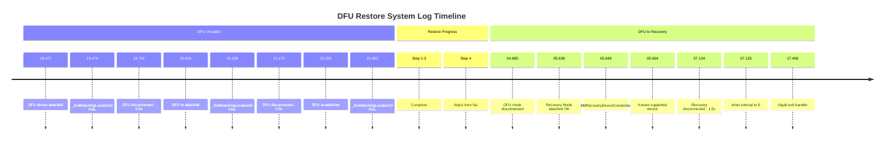

# Mac Studio M1 DFU Restore Log

- **Device**: Mac Studio M1 (Mac13,1)
- **ECID**: 0x1249E03685801
- **Host**: Mac Mini M4 (macOS 26.4.1)
- **Tool**: Apple Configurator 2 / cfgutil 2.19
- **Date**: 2026-04-17

## Issue

Asahi Linux 설치 후 iBoot 손상. 주황색 점멸등 (DFU Mode) 상태.

## Symptom

- 전원 버튼 시 흰색 LED 0.5초 ON → 1초 OFF 반복 (부팅 루프)
- 1TR (One True Recovery) 진입 불가
- 모니터 화면 무반응 (Apple 로고 미표시)

## Attempts

| # | Method | Result |
|---|---|---|
| 1 | Apple Configurator → Revive Device | Error 2006 (66%) |
| 2 | Apple Configurator → Restore Device | Error 2006 (66%) |
| 3 | `cfgutil -f revive` | Error 2006 (66%, step 4/4) |
| 4 | `cfgutil -f restore` (포트 변경) | Error 2006 (66%) |
| 5 | Mac Mini 재부팅 + 포트 변경 후 `cfgutil -f restore` | Error 2006 (50%) |
| 6 | `cfgutil -f restore -I <IPSW> --ignore-boot-transition-timeout` | Error 2006 (50%, step 2/2) |
| 7 | USB-C Hub 경유 연결 | DFU 디바이스 미인식 |
| 8 | `cfgutil --verbose -f restore` | Error 2006 (66%, verbose 로그 수집) |

## Key Finding

Error 2006 발생 원인: DFU → Recovery Mode 전환 시 USB 재연결(reenumeration) 실패.



### USB 로그 패턴 (일관되게 동일)



### 시스템 로그 (`_findMatchingLocationID` 경고)

```
MobileDeviceUpdater: _findMatchingLocationID: Failure to create 'locationID' property from IORegistryEntry
```

## Hardware Tried

- 썬더볼트 케이블 (비정품) × 2종
- Mac Mini M4 뒷면 Thunderbolt 4 포트
- Mac Mini M4 앞면 USB-C 포트
- USB-C Hub 경유

## Full System Log (Verbose, 17:41~17:43)



```
17:41:19.472  DFU device attached [0x100003a51]
17:41:19.474  _AMDFUDeviceConnected
17:41:19.474  _findMatchingLocationID: Failure to create 'locationID' property ← ⚠️
17:41:19.499  Known, supported, and restorable device. Continuing...
17:41:19.742  DFU mode device disconnected (0.5초)
17:41:20.634  DFU device attached [0x100003a65] (재연결)
17:41:20.638  _findMatchingLocationID: Failure ← ⚠️
17:41:21.170  DFU mode device disconnected (0.5초)
17:41:22.059  DFU device attached [0x100003a7b] (재연결)
17:41:22.063  _findMatchingLocationID: Failure ← ⚠️
--- cfgutil restore 시작 (steps 1-3 완료, step 4 66% 진행) ---
17:43:04.685  DFU mode device disconnected
17:43:05.639  Apple Mobile Device (Recovery Mode) attached [0x100003ae1] ← 정상 전환
17:43:05.648  _AMRecoveryDeviceConnected
17:43:05.664  Known, supported, and restorable device. Continuing...
17:43:07.134  Recovery mode device disconnected (1.5초!) ← ❌ 에러 2006
17:43:07.135  DEPRECATED USE: Setting timer interval to 0 requests a 1ns timer
17:43:17.406  cfgutil exit handler
```

### 핵심 관찰사항

1. **`_findMatchingLocationID` 실패** — DFU 연결 시마다 발생. USB 디바이스 locationID 속성 생성 불가
2. **DFU 불안정** — 연결 후 0.5초마다 반복 disconnect/reconnect (restore 전에도)
3. **Recovery Mode 유지 불가** — DFU→Recovery 전환은 성공하나 1.5초 만에 disconnect
4. **`timer interval to 0` 경고** — libdispatch 버그, Recovery disconnect 직전 발생

## IPSW

- 수동 다운로드: `UniversalMac_26.4.1_25E253_Restore.ipsw` (19.7GB)
- zip 무결성 검증 통과 (1,527 files)
- 이미 삭제됨
