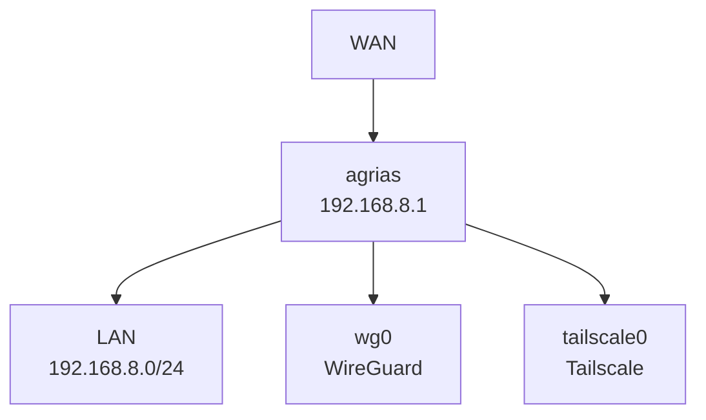
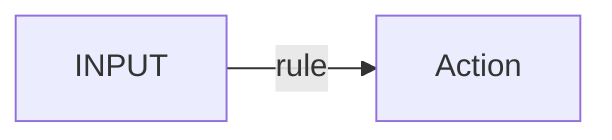

# agrias 라우터 상태 조사 시스템 구현 계획

> **For Claude:** REQUIRED SUB-SKILL: Use superpowers:executing-plans to implement this plan task-by-task.

**Goal:** GL-MT3000 라우터의 현재 상태를 자동으로 수집하고 시각화된 보고서를 생성한다.

**Architecture:** SSH를 통해 라우터에서 정보를 수집하는 스크립트를 작성하고, 수집된 데이터를 바탕으로 Mermaid 다이어그램이 포함된 마크다운 보고서를 생성한다.

**Tech Stack:** Bash (SSH), Python (파싱, 선택적), Markdown (보고서)

---

## Task 1: 프로젝트 디렉토리 생성

**Files:**
- Create: `agrias-investigation-YYYYMMDD/`

**Step 1: 타임스탬프로 디렉토리 생성**

```bash
mkdir -p agrias-investigation-$(date +%Y%m%d)
cd agrias-investigation-$(date +%Y%m%d)
pwd
```

**Step 2: 디렉토리 구조 확인**

```bash
ls -la
```

Expected: 디렉토리 생성 확인

---

## Task 2: collector.sh 스크립트 작성

**Files:**
- Create: `agrias-investigation-YYYYMMDD/collector.sh`

**Step 1: collector.sh 파일 생성**

```bash
cat > agrias-investigation-$(date +%Y%m%d)/collector.sh << 'EOF'
#!/bin/bash

# agrias 라우터 상태 정보 수집 스크립트
# 대상: GL.iNet GL-MT3000 (agrias) - bun-bull.ts.net

set -e

ROUTER="bun-bull.ts.net"
OUTPUT_DIR="$(pwd)"
TIMESTAMP=$(date +%Y%m%d_%H%M%S)
OUTPUT_FILE="$OUTPUT_DIR/raw-data-${TIMESTAMP}.txt"

echo "========================================="
echo "agrias 라우터 정보 수집 시작"
echo "대상: $ROUTER"
echo "출력: $OUTPUT_FILE"
echo "========================================="

ssh root@$ROUTER "
echo '╔════════════════════════════════════════════════════════════╗'
echo '║                    SYSTEM INFORMATION                      ║'
echo '╚════════════════════════════════════════════════════════════╝'
uname -a
echo ''
cat /etc/os-release
echo ''

echo '╔════════════════════════════════════════════════════════════╗'
echo '║                    WIREGUARD STATUS                        ║'
echo '╚════════════════════════════════════════════════════════════╝'
echo '--- Configuration ---'
cat /etc/wireguard/wg0.conf 2>/dev/null || echo 'No WireGuard config found'
echo ''
echo '--- Interface Status ---'
wg show 2>/dev/null || echo 'WireGuard not running'
echo ''
echo '--- Service Status ---'
/etc/init.d/wireguard status 2>/dev/null || echo 'No wireguard init script'

echo ''
echo '╔════════════════════════════════════════════════════════════╗'
echo '║                    UHTTPD WEB SERVER                       ║'
echo '╚════════════════════════════════════════════════════════════╝'
echo '--- UCI Configuration ---'
uci show uhttpd 2>/dev/null || echo 'No uhttpd config'
echo ''
echo '--- Service Status ---'
/etc/init.d/uhttpd status 2>/dev/null || echo 'No uhttpd init script'
echo ''
echo '--- Listening Ports ---'
netstat -tulpn | grep uhttpd || echo 'uhttpd not listening'

echo ''
echo '╔════════════════════════════════════════════════════════════╗'
echo '║                    FIREWALL CONFIGURATION                  ║'
echo '╚════════════════════════════════════════════════════════════╝'
echo '--- UCI Firewall Config ---'
uci show firewall 2>/dev/null | head -100
echo ''
echo '--- iptables Filter Rules ---'
iptables -L -n -v 2>/dev/null || echo 'iptables not available'
echo ''
echo '--- iptables NAT Rules ---'
iptables -t nat -L -n -v 2>/dev/null || echo 'iptables NAT not available'

echo ''
echo '╔════════════════════════════════════════════════════════════╗'
echo '║                    NETWORK INTERFACES                      ║'
echo '╚════════════════════════════════════════════════════════════╝'
ip addr show
echo ''
echo '--- Routing Table ---'
ip route show
echo ''
echo '--- Network Config ---'
uci show network 2>/dev/null | head -50

echo ''
echo '╔════════════════════════════════════════════════════════════╗'
echo '║                    VPN STATUS                             ║'
echo '╚════════════════════════════════════════════════════════════╝'
echo '--- Tailscale ---'
tailscale status 2>/dev/null || echo 'Tailscale not installed or not running'
echo ''
echo '--- Tailscale IPs ---'
tailscale ip 2>/dev/null || echo 'N/A'
echo ''
echo '--- Surfshark Process ---'
ps aux | grep -i surfshark | grep -v grep || echo 'No Surfshark process found'

echo ''
echo '╔════════════════════════════════════════════════════════════╗'
echo '║                    INSTALLED PACKAGES                     ║'
echo '╚════════════════════════════════════════════════════════════╝'
opkg list-installed | grep -E '(wireguard|openvpn|tailscale|uhttpd|firewall|luci)' || echo 'No matching packages'

echo ''
echo '╔════════════════════════════════════════════════════════════╗'
echo '║                    RUNNING SERVICES                       ║'
echo '╚════════════════════════════════════════════════════════════╝'
/etc/init.d/list 2>/dev/null || ls /etc/init.d/ | head -20

echo ''
echo '╔════════════════════════════════════════════════════════════╗'
echo '║                    ACTIVE CONNECTIONS                     ║'
echo '╚════════════════════════════════════════════════════════════╝'
netstat -tulpn | head -30

echo ''
echo '╔════════════════════════════════════════════════════════════╗'
echo '║                    RECENT LOGS                            ║'
echo '╚════════════════════════════════════════════════════════════╝'
logread | tail -50
" > "$OUTPUT_FILE"

echo ""
echo "========================================="
echo "수집 완료!"
echo "파일: $OUTPUT_FILE"
echo "크기: $(wc -l < "$OUTPUT_FILE") 줄"
echo "========================================="
EOF
```

**Step 2: 실행 권한 부여**

```bash
chmod +x agrias-investigation-$(date +%Y%m%d)/collector.sh
ls -l agrias-investigation-$(date +%Y%m%d)/collector.sh
```

Expected: `-rwxr-xr-x` 권한 확인

---

## Task 3: 데이터 수집 실행

**Files:**
- Output: `agrias-investigation-YYYYMMDD/raw-data-YYYYMMDD_HHMMSS.txt`

**Step 1: collector.sh 실행**

```bash
cd agrias-investigation-$(date +%Y%m%d)
./collector.sh
```

Expected: SSH 연결 성공 및 데이터 수집 완료

**Step 2: 수집된 데이터 확인**

```bash
wc -l raw-data-*.txt
head -50 raw-data-*.txt
```

Expected: 수백 줄 이상의 데이터

---

## Task 4: 데이터 분석 및 보고서 작성

**Files:**
- Create: `agrias-investigation-YYYYMMDD/report.md`

**Step 1: 보고서 헤더 작성**

```bash
cat > agrias-investigation-$(date +%Y%m%d)/report.md << 'EOF'
# agrias (GL-MT3000) 라우터 상태 보고서

**수집일자**: YYYY-MM-DD
**장치**: GL.iNet GL-MT3000 (agrias)
**위치**: 베트남 호치민
**Tailscale**: bun-bull.ts.net
**IP**: 192.168.8.1

---

## 요약 (Executive Summary)

<!-- 여기에 주요 발견사항 요약 -->

---
EOF
```

**Step 2: 원시 데이터 파일 내용을 보고서에 통합**

수집된 `raw-data-*.txt` 파일을 읽고 각 섹션을 분석하여 보고서 작성:

```markdown
## 시스템 정보

### OS 정보
```
[raw-data.txt에서 OS 정보 추출]
```

### 하드웨어
```
[raw-data.txt에서 하드웨어 정보 추출]
```

## 네트워크 토폴로지



### 인터페이스 상태
| 인터페이스 | IP 주소 | 상태 | 설명 |
|-----------|---------|------|------|
| [추출된 인터페이스 정보] |  |  |  |

## WireGuard 구성

### 설정 파일
```
[raw-data.txt에서 wg0.conf 추출]
```

### 인터페이스 상태
| 항목 | 값 |
|------|-----|
| 공개키 | [추출] |
| 수신 포트 | [추출] |
| 피어 | [추출] |

## 방화벽 구성

### 주요 규칙 (INPUT)


### 주요 규칙 (FORWARD)


## 서비스 상태

| 서비스 | 상태 | 포트 | 설명 |
|--------|------|------|------|
| uhttpd | [추출] | 80/443 | 웹 UI |
| sshd | [추출] | 22 | SSH |
| WireGuard | [추출] | 51820 | VPN |

## VPN 상태

### Tailscale
```
[raw-data.txt에서 Tailscale status 추출]
```

### WireGuard
```
[raw-data.txt에서 wg show 추출]
```

---

## 부록: 전체 원시 데이터

[raw-data.txt 내용 전체 또는 링크]
```

**Step 3: 수집된 데이터에서 실제 값 추출**

```bash
# 예: OS 정보 추출
grep -A 5 "SYSTEM INFORMATION" raw-data-*.txt

# 예: IP 주소 추출
grep -A 20 "NETWORK INTERFACES" raw-data-*.txt | grep "inet "
```

---

## Task 5: Git 커밋

**Files:**
- Modify: Git repository

**Step 1: 변경사항 커밋**

```bash
git add agrias-investigation-$(date +%Y%m%d)/
git status
```

**Step 2: 커밋 메시지 작성**

```bash
git commit -m "docs: agrias 라우터 상태 조사 보고서

- GL-MT3000 (agrias) 라우터 상태 수집 및 문서화
- 네트워크 토폴로지, 방화벽, 서비스 상태 시각화
- WireGuard, Tailscale, uhttpd 구성 확인

Co-Authored-By: Claude Sonnet 4.6 <noreply@anthropic.com>"
```

---

## 실행 순서 요약

1. Task 1: 프로젝트 디렉토리 생성
2. Task 2: collector.sh 스크립트 작성
3. Task 3: 데이터 수집 실행
4. Task 4: 데이터 분석 및 보고서 작성
5. Task 5: Git 커밋

각 Task는 독립적으로 실행 가능하며, 중간에 검증 단계가 포함되어 있다.
