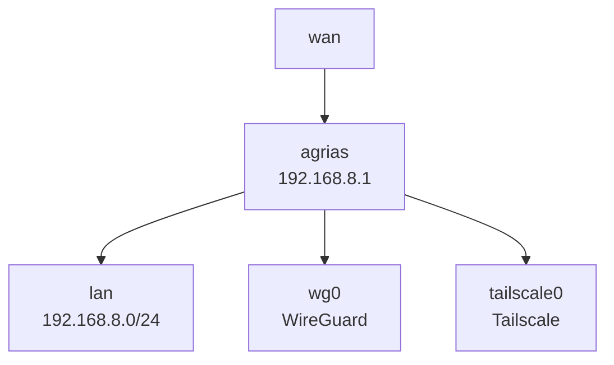
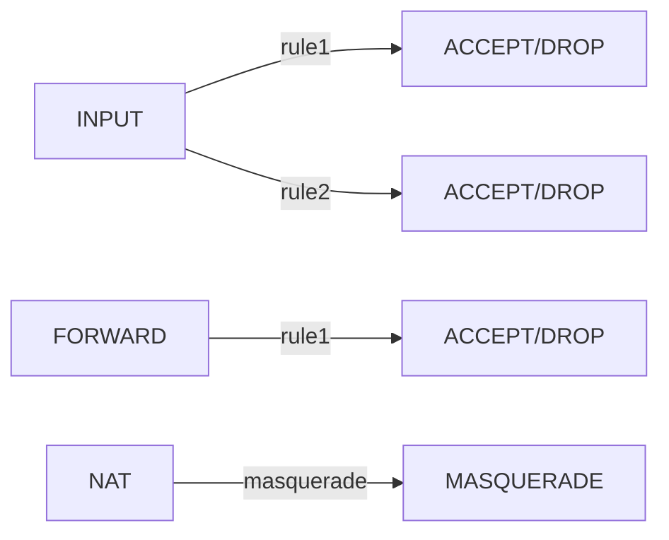
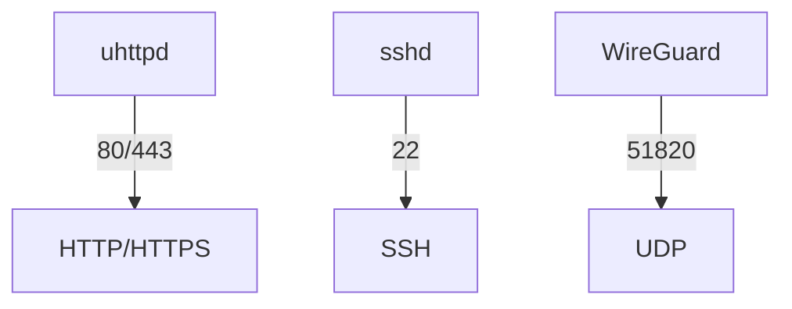

# agrias 라우터 상태 조사 시스템 설계

**날짜**: 2026-03-01
**작성자**: Claude Code
**상태**: 설계 승인 완료

---

## 목적

GL.iNet GL-MT3000 (agrias) 라우터의 현재 상태를 자동으로 수집하고 시각화하여 문서화한다.

- **장치**: GL.iNet GL-MT3000 (agrias)
- **위치**: 베트남 호치민
- **Tailscale**: bun-bull.ts.net
- **IP**: 192.168.8.1

---

## 아키텍처

```
┌─────────────────┐    SSH     ┌──────────────┐
│  Local Machine  │ ◄─────────► │   agrias     │
│  (Claude Code)  │  bun-bull  │  (GL-MT3000) │
└────────┬────────┘   .ts.net   └──────────────┘
         │
         ├─→ collector.sh (SSH commands)
         ├─→ parser.py (parse results)
         └─→ visualizer.md (generate diagrams)
```

---

## 컴포넌트

### 1. collector.sh

**역할**: SSH를 통해 라우터에서 정보 수집

**주요 기능**:
- Tailscale을 통한 SSH 연결 (`bun-bull.ts.net`)
- 계획된 명령어 실행 및 결과 수집
- 타임스탬프 포함 출력 디렉토리 생성

**수집 항목**:
- 시스템 정보 (OS, 커널)
- WireGuard 설정 및 상태
- uhttpd 웹 서버 설정
- 방화벽 규칙 (UCI, iptables)
- 네트워크 인터페이스 및 라우팅
- VPN 상태 (WireGuard, Tailscale, Surfshark)
- 실행 중인 서비스 및 패키지

### 2. parser.py

**역할**: 수집된 원시 데이터를 구조화

**주요 기능**:
- 섹션별 데이터 파싱 (`=== SECTION ===` 구분자)
- JSON 형식으로 변환
- 관련 항목 간 관계 매핑

**출력 형식**:
```json
{
  "system": {...},
  "wireguard": {...},
  "network": {...},
  "firewall": {...},
  "services": [...]
}
```

### 3. visualizer.md (report.md)

**역할**: Mermaid 다이어그램으로 시각화

**시각화 항목**:

#### 네트워크 토폴로지


#### 방화벽 플로우


#### 서비스 포트 맵


---

## 데이터 흐름

```
agrias router → raw output → structured data → visualizations
     (SSH)        (save)        (parse)        (Mermaid)
```

1. **수집**: `collector.sh` 실행 → `raw-data.txt` 생성
2. **파싱**: `parser.py` 실행 → `parsed-data.json` 생성
3. **시각화**: 분석된 데이터를 바탕으로 `report.md` 작성

---

## 출력 파일 구조

```
agrias-investigation-20260301/
├── raw-data.txt           # 원시 SSH 출력
├── parsed-data.json       # 파싱된 구조화 데이터
└── report.md              # 시각화 포함 최종 보고서
    ├── 요약 (Executive Summary)
    ├── 네트워크 토폴로지 (Mermaid)
    ├── 방화벽 플로우 (Mermaid)
    ├── 서비스 상태 (Mermaid + Table)
    ├── WireGuard 구성 (Table)
    └── 부록: 원시 데이터
```

---

## 실행 순서

1. `collector.sh` 실행 → 원시 데이터 수집
2. 수집된 데이터 검토
3. `parser.py` 실행 (선택) → JSON 변환
4. `report.md` 작성 → 시각화 포함 보고서 생성
5. Git 커밋으로 문서화

---

## 기술적 고려사항

### SSH 연결
- Tailscale 호스트네임 사용: `bun-bull.ts.net`
- 인증: SSH 키 또는 비밀번호
- 타임아웃: 느린 네트워크 고려 (베트남)

### 파싱 복잡도
- UCI 구성은 표준화된 형식이므로 파싱 용이
- iptables 출력은 복잡하므로 주요 규칙만 추천

### 시각화 범위
- 너무 복잡한 다이어그램은 피함
- 핵심 구조와 흐름에 집중
- 상세 데이터는 테이블로 보완

---

## 성공 기준

1. ✅ 계획된 모든 정보 수집 완료
2. ✅ 네트워크 토폴로지 시각화
3. ✅ 방화벽 규칙 플로우 차트
4. ✅ 서비스/포트 매핑
5. ✅ 문서화된 보고서 생성

---

## 다음 단계

이 설계 문서를 승인한 후 `writing-plans` 스킬을 호출하여 상세 구현 계획을 작성한다.
